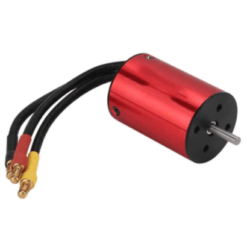
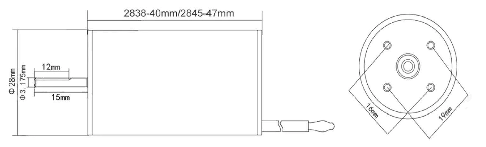

# BLDC INRUNNER 2838 3200kV

Brushless inrunners of this form-factor have been proven all over the world as exceptional power systems for beetleweight combat robots. Where this motor differs is its increased power, RPM, and torque when compared to other simmilar products while maintaing the same formfactor and weight. 

This is a [New Zealand](https://www.google.co.nz/maps/place/Christchurch+New+Zealand) based [cb-technology](https://www.cb-technology.co.nz/) product by Connor Benton.

## FEATURES
- Billet Aluminium (6061 T6) CNC Machined Motor Can.
- Motor components anodized Red and Black.
- Oversized ABEC5 Bearings.
- Removable/replacable rotor if damage is sustained.
- 3.5mm gold-plated motor bullet connectors.
- Different colour heatshrink used on each phase to minimise confusion when wiring.

## SPECIFICATIONS
- **Dimensions :** *see the Mechanical Drawing seciton below*
- **Shaft Diameter:** 1/8" = 3.175 mm
- **Weight:** 95 g
- **Watts:** 600 W
- **Voltage - Max:** 16V (4s LiPo)
- **Current - Max:** 35 A
- **Rotational Speed - Max:** 50 000 RPM
- **Velocity Constant (Kv):** 3200 RPM/V
- **Torque Constant (K&tau;):** 0.2984 N⋅cm
- **Rotor Poles:** 4
 
 ## MECHANICAL DRAWING
